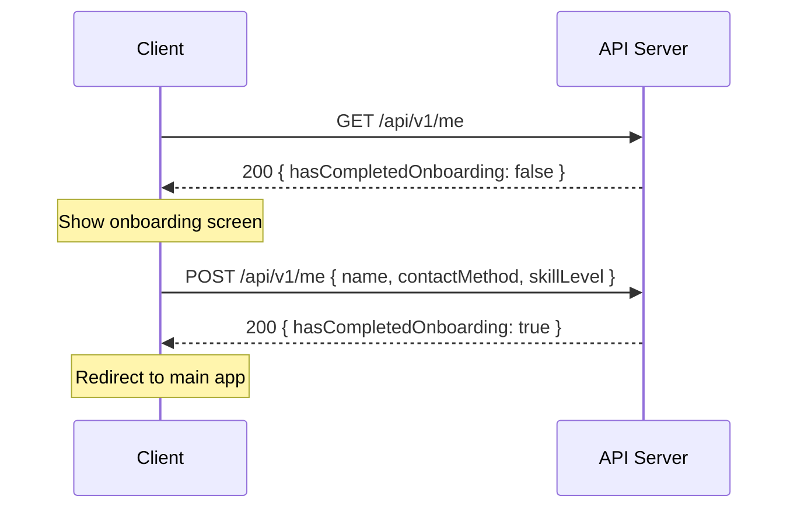
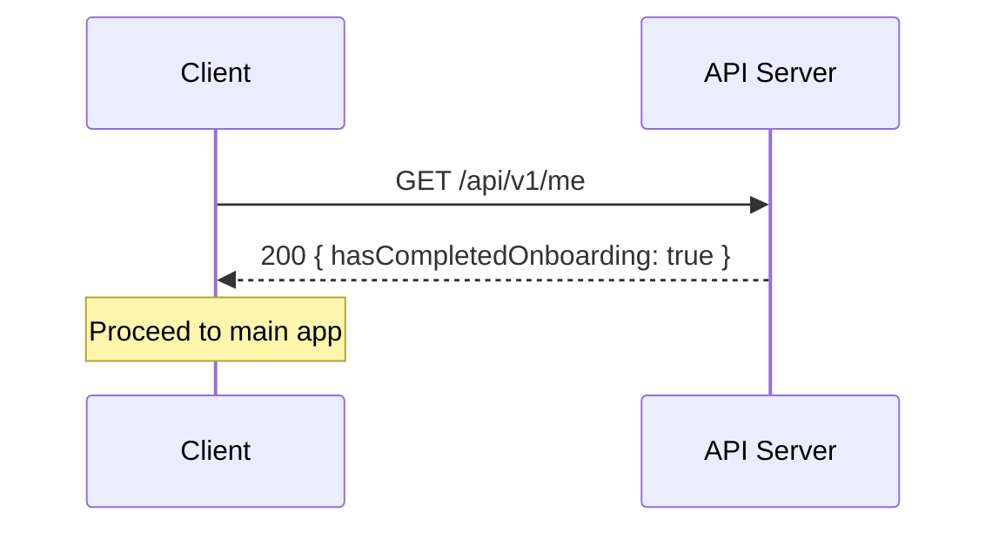
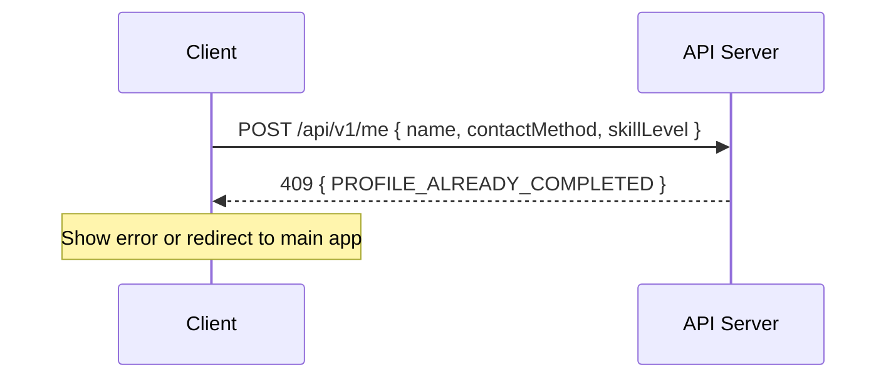

# Onboarding

## Overview

New users must complete a one-time profile completion step before accessing the main application. The client checks onboarding status on every app launch via `GET /api/v1/me` and redirects incomplete users to the onboarding screen.

## Profile Fields

| Field          | Type                          | Validation                                                                 | Remarks |
|----------------|-------------------------------|----------------------------------------------------------------------------|---------|
| `name`         | `string`                      | <span class="attention">Required</span>, non-blank, max 200 characters                                    | |
| `contactMethod`| `array` of `ContactMethodDto` | <span class="attention">At least one</span> valid contact method (`whatsapp`, `telegram`, or `messenger`) | |
| `skillLevel`   | `integer`                     | <span class="attention">Required</span>, non-null                                                         | See [Badminton levels](/docs/sports/badminton#skill-levels) |

### ContactMethodDto

| Field   | Type     | Description                                           |
|---------|----------|-------------------------------------------------------|
| `name`  | `string` | One of `whatsapp`, `telegram`, `messenger`            |
| `value` | `string` | The contact handle or number; must be non-blank       |

## API Contract

All endpoints are under `/api/v1/me` and require a valid JWT. Responses are wrapped in a standard `ApiResponse` envelope:

```json
{
  "success": true,
  "data": { ... },
  "message": "...",
  "timestamp": "2026-04-04T12:00:00Z",
  "path": "/api/v1/me"
}
```

### `GET /api/v1/me`

Returns the current user profile and onboarding state. Called on every app launch.

**cURL**

```bash
curl -X GET http://localhost:8080/api/v1/me \
  -H "Authorization: Bearer <TOKEN>"
```

**Response `200 OK`**

```json
{
  "success": true,
  "data": {
    "userId": "d290f1ee-6c54-4b01-90e6-d701748f0851",
    "authProvider": "auth0",
    "providerUuid": "auth0|abc123",
    "name": null,
    "contactMethod": [],
    "skillLevel": null,
    "hasCompletedOnboarding": false
  },
  "message": "User profile retrieved successfully.",
  "timestamp": "2026-04-04T12:00:00Z",
  "path": "/api/v1/me"
}
```

- `hasCompletedOnboarding: false` — redirect to the onboarding screen.
- `hasCompletedOnboarding: true` — proceed to the main app.

### `POST /api/v1/me`

Completes the user profile. This is a one-time operation — calling it again after onboarding is complete returns `409 Conflict`.

**cURL**

```bash
curl -X POST http://localhost:8080/api/v1/me \
  -H "Authorization: Bearer <TOKEN>" \
  -H "Content-Type: application/json" \
  -d '{
    "name": "Jane Doe",
    "contactMethod": [
      { "name": "whatsapp", "value": "+6591234567" },
      { "name": "telegram", "value": "@janedoe" }
    ],
    "skillLevel": 3
  }'
```

**Request body**

```json
{
  "name": "Jane Doe",
  "contactMethod": [
    { "name": "whatsapp", "value": "+6591234567" },
    { "name": "telegram", "value": "@janedoe" }
  ],
  "skillLevel": 3
}
```

**Response `200 OK`**

```json
{
  "success": true,
  "data": {
    "userId": "d290f1ee-6c54-4b01-90e6-d701748f0851",
    "authProvider": "auth0",
    "providerUuid": "auth0|abc123",
    "name": "Jane Doe",
    "contactMethod": [
      { "name": "whatsapp", "value": "+6591234567" },
      { "name": "telegram", "value": "@janedoe" }
    ],
    "skillLevel": 3,
    "hasCompletedOnboarding": true
  },
  "message": "User profile completed successfully.",
  "timestamp": "2026-04-04T12:00:00Z",
  "path": "/api/v1/me"
}
```

## Sequence Diagram

### Happy Path



### Already Completed



### Duplicate Completion Attempt



## Error Handling

| Scenario                          | HTTP Status | Error Code                     | Client Behavior                         |
|-----------------------------------|-------------|--------------------------------|-----------------------------------------|
| Missing or invalid required fields| `400`       | Validation error               | Highlight invalid fields, stay on screen|
| Profile already completed         | `409`       | `PROFILE_ALREADY_COMPLETED`    | Redirect to main app                    |
| Auth token expired / missing      | `401`       | —                              | Redirect to login                       |
| User not found                    | `404`       | —                              | Redirect to login                       |
| Server error                      | `500`       | —                              | Show retry prompt                       |

## Implementation Notes

- The client must call `GET /api/v1/me` on every cold start — never cache onboarding state locally, as it may be reset server-side.
- Profile completion is a single atomic operation, not a multi-step flow. All required fields (`name`, `contactMethod`, `skillLevel`) must be submitted together.
- At least one contact method with a valid name (`whatsapp`, `telegram`, or `messenger`) and a non-blank value is required.
- After completion, profile updates are done via `PUT /api/v1/me`.
