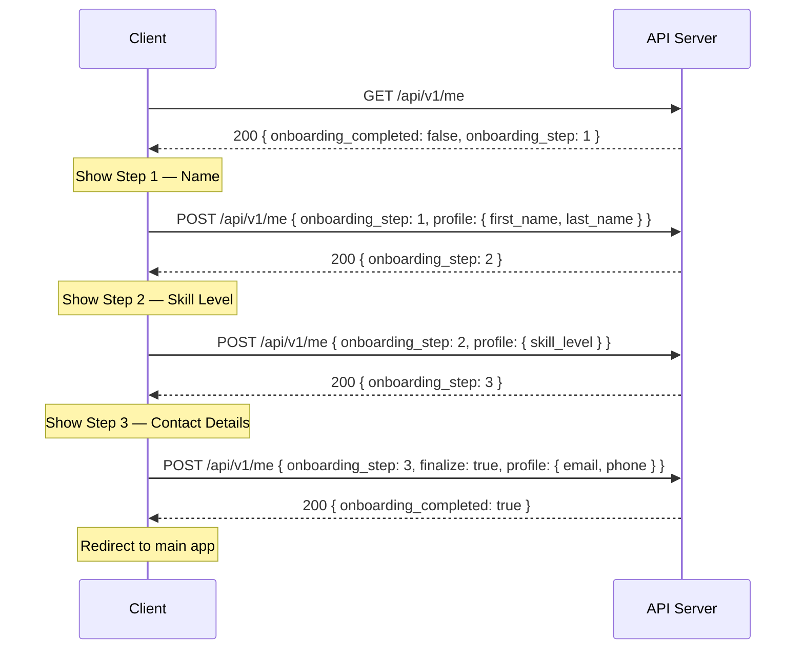
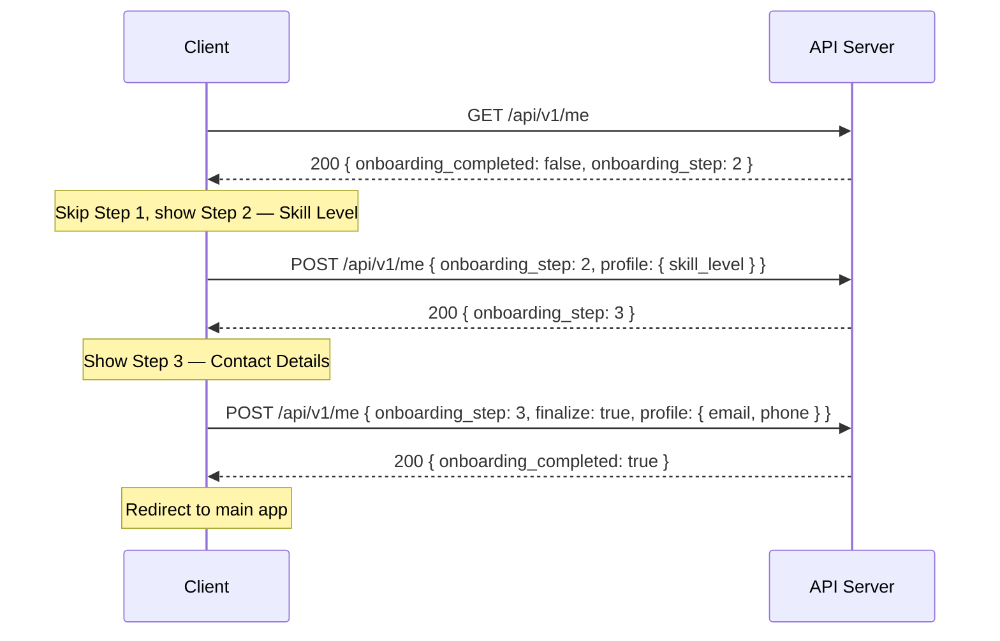

# New User Onboarding

## Overview

New users must complete a mandatory 3-step onboarding flow before accessing the main application. The flow captures essential profile information and is resumable across sessions.

## Onboarding Steps

| Step | Screen          | Fields Collected                       | Validation                                      |
|------|-----------------|----------------------------------------|--------------------------------------------------|
| 1    | Name            | `first_name`, `last_name`              | Required, 1–50 characters each                   |
| 2    | Skill Level     | `skill_level` (`beginner` / `intermediate` / `advanced`) | Required, must be one of the enum values |
| 3    | Contact Details | `email`, `phone` (optional)            | `email`: valid format, `phone`: E.164 if present |

Each step is persisted server-side on submission so the user can resume from where they left off.

## API Contract

### `GET /api/v1/me`

Called on every app launch. Returns the current user profile and onboarding state.

**Response `200 OK`**

```json
{
  "id": "usr_abc123",
  "onboarding_completed": false,
  "onboarding_step": 2,
  "profile": {
    "first_name": "Jane",
    "last_name": "Doe",
    "skill_level": null,
    "email": null,
    "phone": null
  }
}
```

- `onboarding_completed: false` — the client must redirect to step `onboarding_step`.
- `onboarding_completed: true` — proceed to the main app.

### `POST /api/v1/me`

Submits profile data. Called once per step, and a final time to mark onboarding as complete.

**Request body (step submission)**

```json
{
  "onboarding_step": 2,
  "profile": {
    "skill_level": "intermediate"
  }
}
```

**Request body (finalize)**

```json
{
  "onboarding_step": 3,
  "finalize": true,
  "profile": {
    "email": "jane@example.com",
    "phone": "+6591234567"
  }
}
```

- When `finalize: true` is included and all required fields are present, the server sets `onboarding_completed` to `true`.
- Returns `422 Unprocessable Entity` if required fields for the current step are missing or invalid.

## Sequence Diagram

### Happy Path (new user, no prior session)



### Session Resumption (returning user, partially completed)



## Error Handling

| Scenario                         | HTTP Status | Client Behavior                          |
|----------------------------------|-------------|------------------------------------------|
| Missing required fields          | `422`       | Highlight invalid fields, stay on step   |
| Auth token expired               | `401`       | Redirect to login                        |
| Server error                     | `500`       | Show retry prompt                        |
| Network failure                  | —           | Show offline banner, retry on reconnect  |

## Implementation Notes

- The client must call `GET /api/v1/me` on every cold start — never cache onboarding state locally, as an admin may reset it server-side.
- Step data is saved incrementally; there is no "save all at once" step except when `finalize: true` is sent on the last step.
- The `phone` field is optional but, if provided, must conform to E.164 format.
