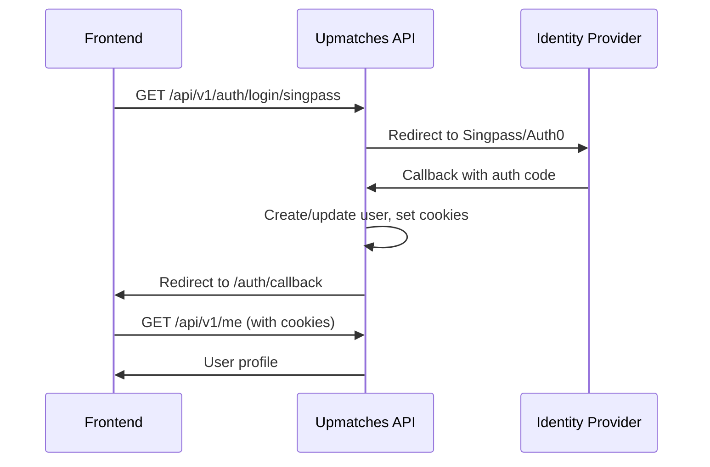

# Backend

Step-by-step guide to run the Upmatches API on your machine.

## Prerequisites

Install all of the following before continuing.

| Tool               | Version | Purpose                             | Install link                                    |
|--------------------|---------|-------------------------------------|-------------------------------------------------|
| **Docker Desktop** | Latest  | Runs the API, PostgreSQL, and Redis | https://www.docker.com/products/docker-desktop/ |
| **Git**            | Latest  | Clone the repository                | https://git-scm.com/downloads                   |

:::note
You do **not** need Java or Maven installed. Everything runs inside Docker containers.
:::

### Verify installations

Open a terminal and run each command. If any command fails, revisit the install link above.

```bash
docker --version        # e.g. Docker version 28.x.x
docker compose version  # e.g. Docker Compose version v2.x.x
git --version           # e.g. git version 2.x.x
```

:::tip Windows users
Use PowerShell or Windows Terminal. The commands below work on macOS, Linux, and Windows.
:::

---

## 1. Clone the repository

```bash
git clone <repository-url>
cd upmatches
```

---

## 2. Configure environment variables

Copy the example environment file and fill in the required values:

```bash
cp .env.example .env
```

Open `.env` in your editor and update the following:

```dotenv
# Pull the pre-built image from Docker Hub
DOCKER_IMAGE=chownrmrf/upmatches-api
IMAGE_TAG=latest

# Set your frontend origin so the API allows cross-origin requests
CORS_ALLOWED_ORIGINS=http://localhost:3002

# Infisical credentials (ask your team lead)
# Required for login flows (Singpass and Auth0) to work
INFISICAL_CLIENT_ID=<your-client-id>
INFISICAL_CLIENT_SECRET=<your-client-secret>
INFISICAL_PROJECT_ID=<your-project-id>
```

The remaining values in `.env` have sensible defaults and can be left as-is.

### Default infrastructure credentials (already configured)

| Service    | Host        | Port   | Username   | Password   | Database        |
|------------|-------------|--------|------------|------------|-----------------|
| PostgreSQL | `localhost` | `5432` | `postgres` | `postgres` | `upmatches_dev` |
| Redis      | `localhost` | `6379` | _(none)_   | _(none)_   | _(default)_     |

---

## 3. Start the services

Pull the latest API image and start all services (API, PostgreSQL, Redis):

```bash
docker compose pull && docker compose up -d
```

Wait a few seconds, then verify all three containers are running:

```bash
docker compose ps
```

You should see `upmatches-api`, `upmatches-db`, and `upmatches-redis` with status **healthy** (or **running** for the API).

On first startup the API will:

1. Connect to PostgreSQL and **automatically apply database migrations** (create tables, indexes, etc.).
2. Connect to Redis.
3. Fetch secrets from Infisical (if configured).

---

## 4. Verify it works

```bash
curl http://localhost:8080/actuator/health
```

Expected response:

```json
{
  "status": "UP"
}
```

---

## Quick reference

| What                         | Command                                      |
|------------------------------|----------------------------------------------|
| Pull latest API image        | `docker compose pull`                        |
| Start all services           | `docker compose up -d`                       |
| Stop all services            | `docker compose down`                        |
| Stop and **delete all data** | `docker compose down -v`                     |
| View logs (all services)     | `docker compose logs -f`                     |
| View API logs only           | `docker compose logs -f api`                 |
| Check service status         | `docker compose ps`                          |
| Check API health             | `curl http://localhost:8080/actuator/health` |

---

## API overview for frontend developers

### Base URL

```
http://localhost:8080
```

### Authentication

The API uses **cookie-based JWT authentication** (BFF pattern). After a successful login flow, the API sets `access_token` and `refresh_token` cookies. Your frontend should include credentials in requests:

```javascript
fetch("http://localhost:8080/api/v1/me", {
  credentials: "include",  // sends cookies with the request
});
```

### CORS

The API is configured to allow requests from `http://localhost:3002` by default. If your frontend runs on a different port, update the `CORS_ALLOWED_ORIGINS` value in your `.env` file and restart the API:

```bash
docker compose restart api
```

Multiple origins can be separated with a semicolon (`;`).

### Available endpoints

| Method   | Route                         | Auth required | Description                        |
|----------|-------------------------------|:-------------:|------------------------------------|
| `GET`    | `/actuator/health`            |      No       | Health check                       |
| `GET`    | `/api/v1/auth/login/singpass` |      No       | Start Singpass login flow          |
| `GET`    | `/api/v1/auth/login/auth0`    |      No       | Start Auth0 login flow             |
| `GET`    | `/callback/singpass`          |      No       | Singpass OAuth callback            |
| `GET`    | `/callback/auth0`             |      No       | Auth0 OAuth callback               |
| `POST`   | `/api/v1/auth/refresh`        |      No       | Refresh access token               |
| `POST`   | `/api/v1/auth/logout`         |      No       | Logout (clears cookies)            |
| `GET`    | `/api/v1/me`                  |      Yes      | Get current user profile           |
| `POST`   | `/api/v1/me`                  |      Yes      | Complete user profile (onboarding) |
| `PUT`    | `/api/v1/me`                  |      Yes      | Update user profile                |
| `DELETE` | `/api/v1/me`                  |      Yes      | Delete user account                |
| `GET`    | `/api/v1/venues`              |      Yes      | Get all venues                     |
| `POST`   | `/api/v1/venues/upload`       |      Yes      | Bulk import venues from JSON file  |
| `GET`    | `/.well-known/jwks.json`      |      No       | Public signing keys (JWKS)         |

### Auth flow (how login works)



1. Frontend redirects the user to `GET /api/v1/auth/login/singpass` (or `/auth0`).
2. The API redirects the user to the identity provider (Singpass or Auth0).
3. After login, the identity provider redirects back to the API callback URL.
4. The API processes the callback, creates or updates the user, and redirects to `http://localhost:3002/auth/callback` with auth cookies set.
5. Frontend can now call authenticated endpoints (e.g., `GET /api/v1/me`).

:::info New users
If the user has not completed onboarding, the callback redirect includes `?isNewUser=true`. Use this to route new users to an onboarding flow.
:::

---

## Troubleshooting

### Port already in use

If port `8080`, `5432`, or `6379` is already taken by another process:

```bash
# Check what's using a port (example: 8080)
# macOS/Linux
lsof -i :8080
# Windows (PowerShell)
netstat -ano | findstr :8080
```

Stop the conflicting process, or change the port in your `.env` file (e.g., `API_PORT=9090`) and restart.

### Docker containers not starting

```bash
# View container logs for errors
docker compose logs
```

### API fails to connect to database

Make sure the database and Redis containers are healthy before the API starts. Docker Compose handles this automatically via health checks, but if you see connection errors:

```bash
docker compose ps
```

Both `upmatches-db` and `upmatches-redis` should show status **healthy**. If they show **starting**, wait a few seconds and check again.

### Login flows not working

If Singpass or Auth0 login redirects fail, ensure the Infisical credentials are set correctly in your `.env` file. Without them, the API cannot fetch the required secrets (private keys, client secrets).

### Reset everything (nuclear option)

Stop containers, delete all data volumes, and start fresh:

```bash
docker compose down -v
docker compose pull && docker compose up -d
```

The API will re-create the database from scratch on next startup.
